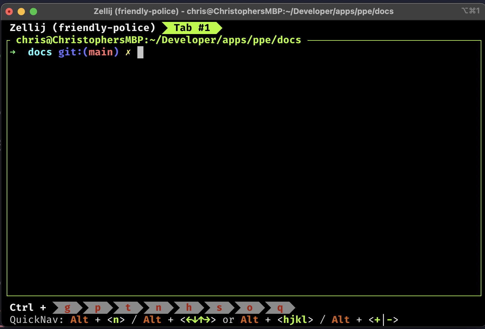
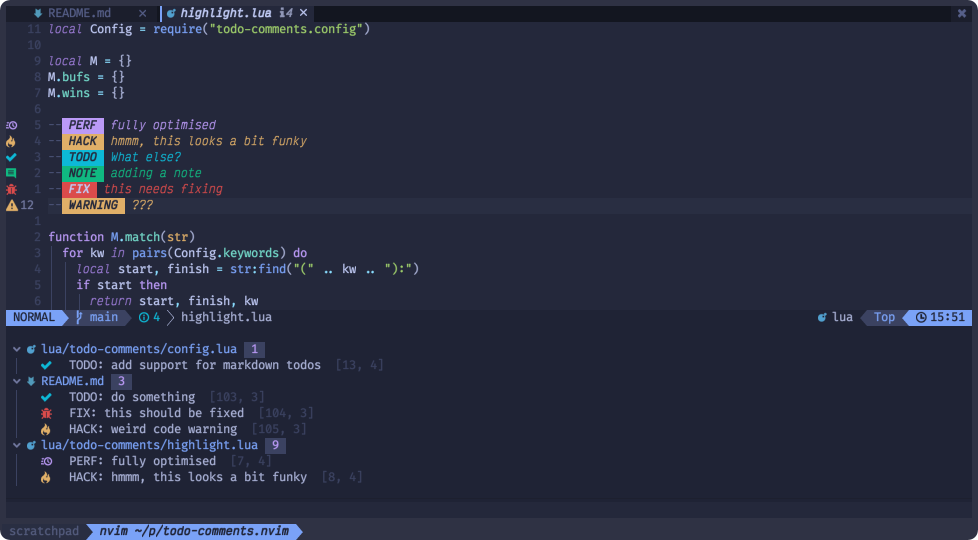

# Description

The project we will will build is on the medium side in terms of size and complexeity. It is designed to be a good mentoring project as well as a tool that is actually useful. 

> The most important thing is that this is a learning project and we will take the long way to complete it. 
 

The personal productivity environment (PPE) is a terminal based workspace to manage some productivity tools. 


## Why are we building this?
Due to the way corporate networks work, one cannot simply add browser extensions or download any tool off of the web. However, build it yourself and you can generally use it. 


## The Concept

The idea came from looking at a terminal multiplex application called [Zellij](https://zellij.dev/documentation/). 



Notice the buttons on the bottom of the screen. I thought it would be slick to build a few applications and integrate them and all of their terminal based controls into a similar type of system. 

### Integrations
I have a few. We can add more to this list for sure. 

- Terminal based todo app
  - take todos from a command line 
  - create a root location to scan from to grab todo style code comments. 
    - 
- Project based bookmarker
  - should support web links that can be "clicked on"
  - should support documentation links that open in a "Finder" window which are opened through whatever tool the machine has set for that file type
  - Support global and project based lists and the ability to switch the mode on which version you are looking at.
- [Lazy Git](https://github.com/jesseduffield/lazygit)
  - I do not know how I feel about this one yet. The integration may be challenging and may not be worth it. This can always be opened up in a separate tab in the terminal multiplexer.
- [Pomodoro Timer](https://todoist.com/productivity-methods/pomodoro-technique)
  - should have the ability to adjust the time increments
  - When timer goes off, use the operating systems FS notify event system
  - Should timers auto-restart....maybe a configuration option.  


The initial plan is to design and build these are stand-alone apps. We will design them to have thier own configuration options and not worry about the integrations at first. At the end we will tie them all together into a single "meta-app" with all the keybinding goodness. 


 ```mermaid
    graph TD;
        A-->B;
        A-->C;
        B-->D;
        C-->D;
        D-->A;
```


# Tools
- [Mermaid](https://mermaid.js.org) for all diagramming 
- [MDBook](https://github.com/rust-lang/mdBook) for the notes and planning. I have already integrated Mermaid into MDbook. 
  - To run mdbook, run this command from the docs folder: mdbook serve
- Programming Languages??
  - I am really torn between Rust and Go. I will let you convince me. 